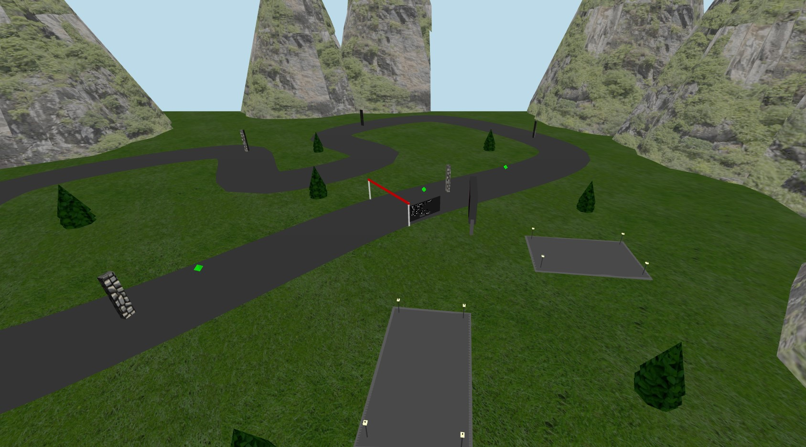

# SGI 2024/2025

## Group T08-G09
### Final Grade: 19
| Name             | Number    | E-Mail             |
| ---------------- | --------- | ------------------ |
| Pedro Moreira        | 201904642 | up201904642@up.pt                |
| Gonçalo Matias         | 202108703 | up202108703@up.pt                |

----

## Projects

### [TP1 - ThreeJS Basics](tp1)
#### Grade: 18

- Realistic Scene
- Every Requirement Implemented
- Many extra objects

-----

### [TP2 - Development of a 3D graphics application](tp2)
#### Grade: 19.5

- Realistic Silent Hill 1 Hospital Room Scene
- Every Requirement Implemented
- Many extra objects

----

### [TP3 - Development of a game](tp3)
#### Grade: 17.7

- Balloon Racing Game
- Various Balloons to choose from
- 1v1 competition

