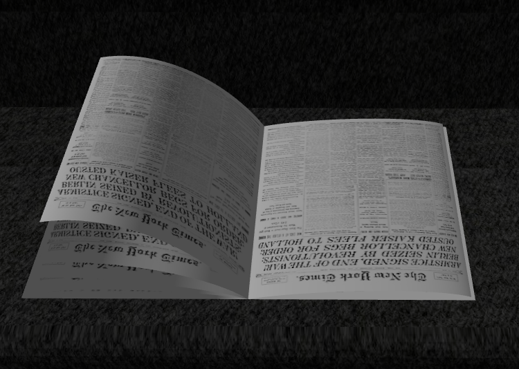

# SGI 2024/2025

## Group T08-G09
| Name             | Number    | E-Mail             |
| ---------------- | --------- | ------------------ |
| Pedro Moreira        | 201904642 | up201904642@up.pt                |
| Gonçalo Matias         | 202108703 | up202108703@up.pt                |

----

## Project information

The main objectives of this project is to use Three.js and JavaScript to design primitives, organize them and implement an interface that allows us to control their properties. The most important topics to be covered are:

- Create simple Objects
- Create Groups
- Affect geometric transformations to existing objects/groups;
- Affect visualization properties to existing objects;
- Create and use a graphical interface (GUI) to control aspects of the scene and its objects.

Our README is divided by sections, so it is easier to understand everything we implemented for this project. 

We are very proud of the work we have done. We really think we created a realistic scene. 
We would say the main strong point is the fact that we created a scene that really resembles a real life scenario. We included every object a normal house would have. We also like the way we organized our code: it is easy to understand and find where each object is defined and created. We are also very happy that we managed to create extra objects that were not requirements, to make our scene even more realistic and appealing. 

Relative link: 
[Our Scene](tp1/MyContents.js)

Below are some images that show the work we produced for this project. 

- [Requirements](#requirements)
   - [Camera Controls](#camera-controls)
   - [Floor](#floor)
   - [Beetle](#beetle)
   - [Cake](#cake)
   - [Candle](#candle)
   - [Chair](#chair)
   - [Flower](#flower)
   - [Jar](#jar)
   - [Lamp](#lamp)
   - [Newspaper](#newspaper)
   - [Painting](#painting)
   - [Plate](#plate)
   - [Slice](#slice)
   - [Spring](#spring)
   - [Table](#table)
   - [Walls](#walls)
   - [Window](#window)
   - [Shadows](#shadows)
   - [Spotlight](#spotlight)
- [Extra Features](#extra-features)
   - [Carpet](#carpet)
   - [Couch](#couch)
   - [Cup](#cup)
   - [Door](#door)
   - [FloorLamp](#floorlamp)
   - [Fork](#fork)
   - [Knife](#knife)
   - [Napkin](#napkin)
   - [TV](#tv)

----

### Requirements

#### Camera Controls

#### Beetle

#### Cake

#### Candle

#### Chair

#### Flower

#### Jar

#### Lamp

#### Newspaper

#### Painting

#### Plate

#### Slice

#### Spring

#### Table

#### Walls

#### Window

### Extra Features

#### Carpet

#### Couch

#### Cup

#### Door

#### FloorLamp

#### Fork

#### Knife

#### Napkin

#### TV

----
## Issues/Problems

- While we incorporated creativity into our project, we believe there was room for more. Our goal was to make the scene as realistic as possible, but we feel we could have enriched it further by adding more objects or additional light sources.

- By the end of our development, the performance of our scene began to decline. This might be due to the way we are grouping geometries and meshes. More thorough testing would have been necessary to pinpoint and resolve this issue effectively.