# SGI 2024/2025

## Group T08-G09
| Name             | Number    | E-Mail             |
| ---------------- | --------- | ------------------ |
| Pedro Moreira        | 201904642 | up201904642@up.pt                |
| Gonçalo Matias         | 202108703 | up202108703@up.pt                |

----

## Project information

The main objective of this project was to create an application equipped with a small 3D graphics engine. The application must be capable of producing images of any scene, which is specified through a text file to be read by the application. We used the YASF format, where the syntax follows the JSON tag format. The application reads a .json file, that describes the scene. We also had to implement an interface that allows us to control the scene properties. 

We got inspiration from the videogame Silent Hill 1, where we decided to replicated the well known Hospital Room.

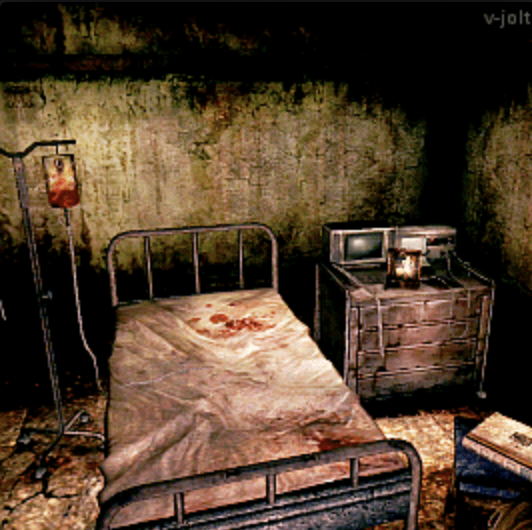
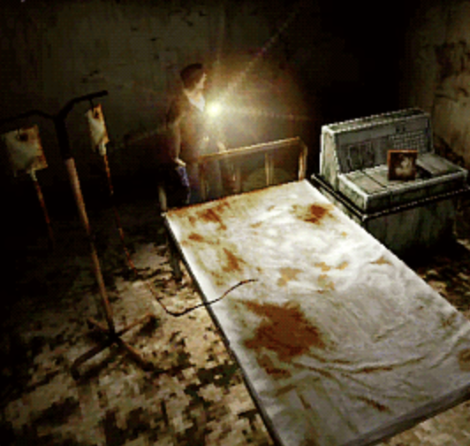
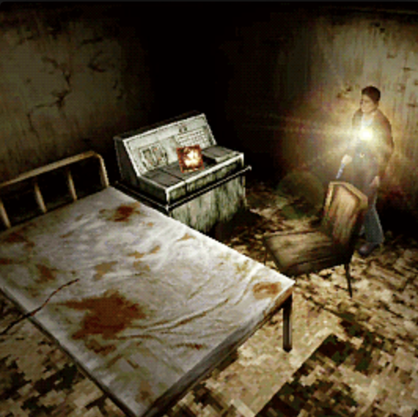

The most important topics to be covered are:

- Scene Graph (transformations, hierarchy, inheritance of properties)
- Level of detail (at least one object; quality, number of representations...)
- Advanced textures (sky box, mip-maps, bump-textures, video-textures)
- Wireframe visualisation (at least one intermediate object/node)
- Buffer Geometry
- Level and quality of scene control (2D interface)
- Creativity of the scene (creative use of the techniques covered; final look)
- Structuring, readability and comments/documentation of the code developed

Every requirement was followed, respected and implemented. 

Our README is divided by sections, so it is easier to understand everything we implemented for this project. 

Relative link: 
[Our Scene](tp2/scenes/room/room.json)

Below are some images that show the work we produced for this project. 

 - [Controls](#camera-controls)
 - [Bed](#bed)
 - [Buffer](#buffer)
 - [Chair](#chair)
 - [Corridor](#corridor)
 - [Cupboard](#cupboard)
 - [Door](#door)
 - [IV Stand](#stand)
 - [Machine](#machine)
 - [Painting](#painting)
 - [Portrait](#portrait)
 - [Room](#room)
 - [TV](#tv)

----

#### Images and explanations

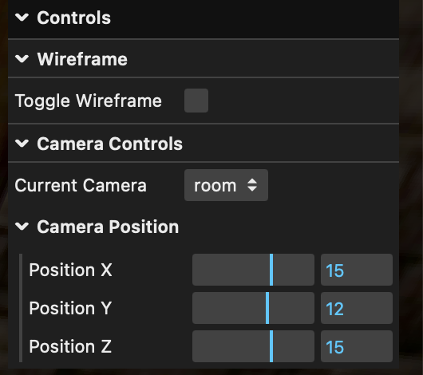

In terms of controls, we have multiple: we can toggle the wireframe, change and choose different perspectives, and change the x,y and z values for the cameras. 

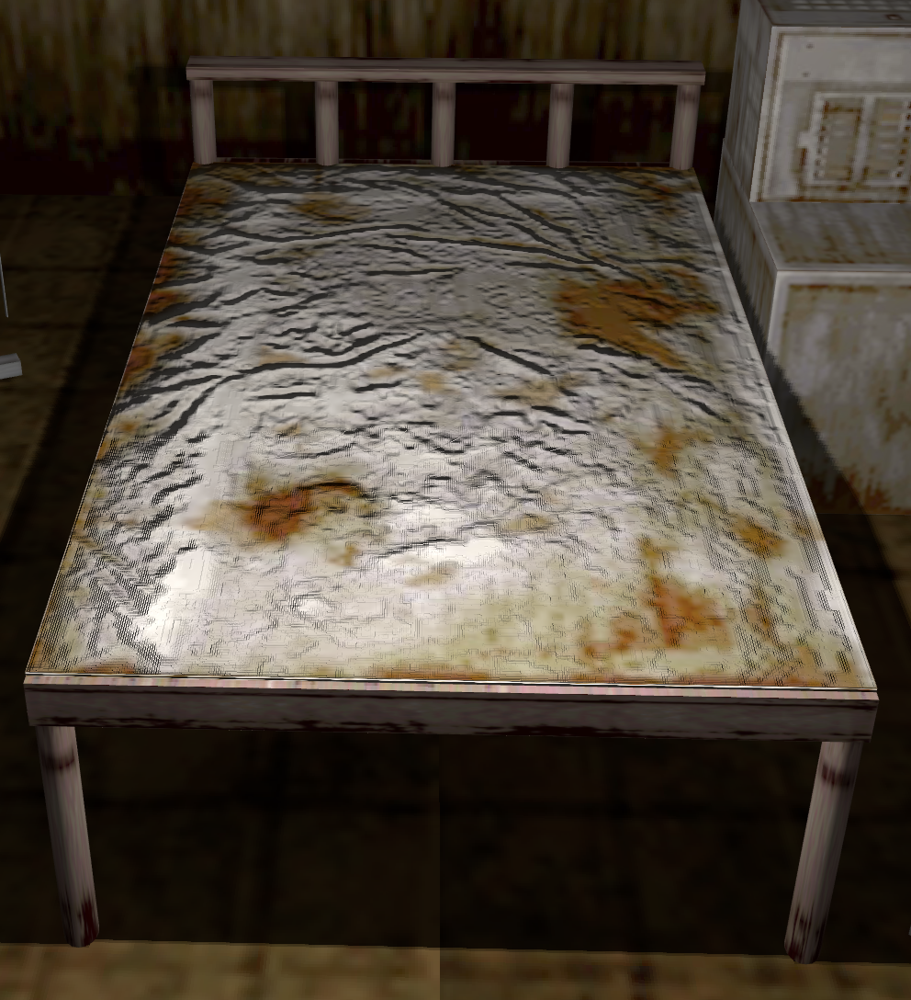

The bed is composed by a mattress and a structure. In the mattress we applied bump and mipmap textures, to give more realism to the scene. The mattress is bloody, emphasizing the terror scene we tried to create. 

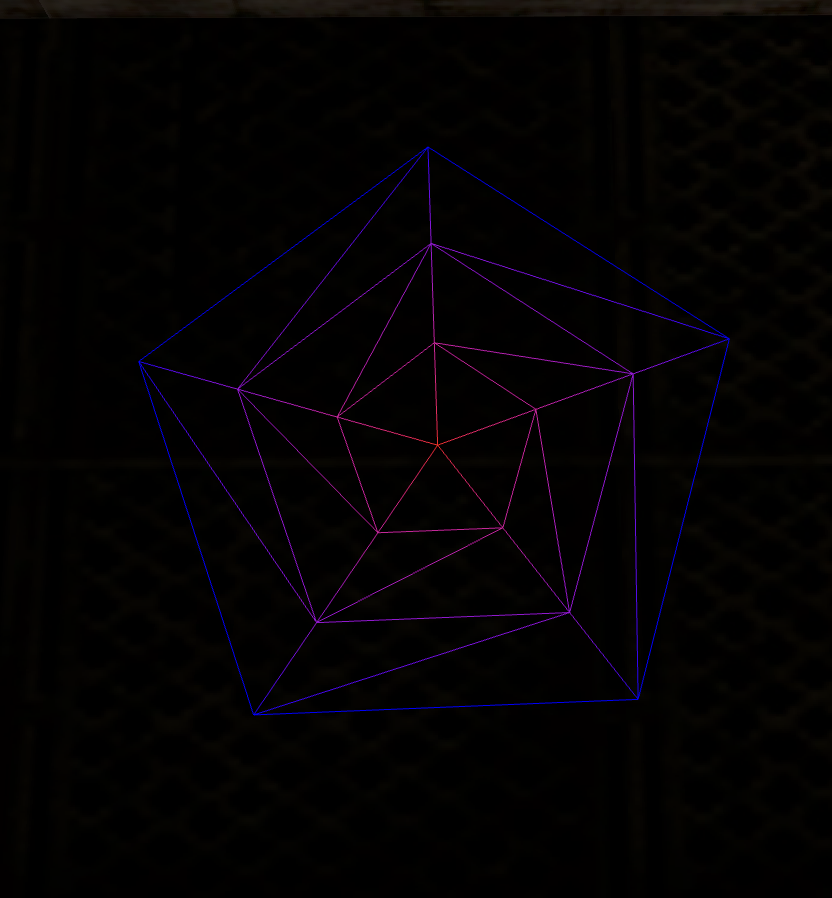

The buffer polygon is composed of 3 stacks and 5 slices. 

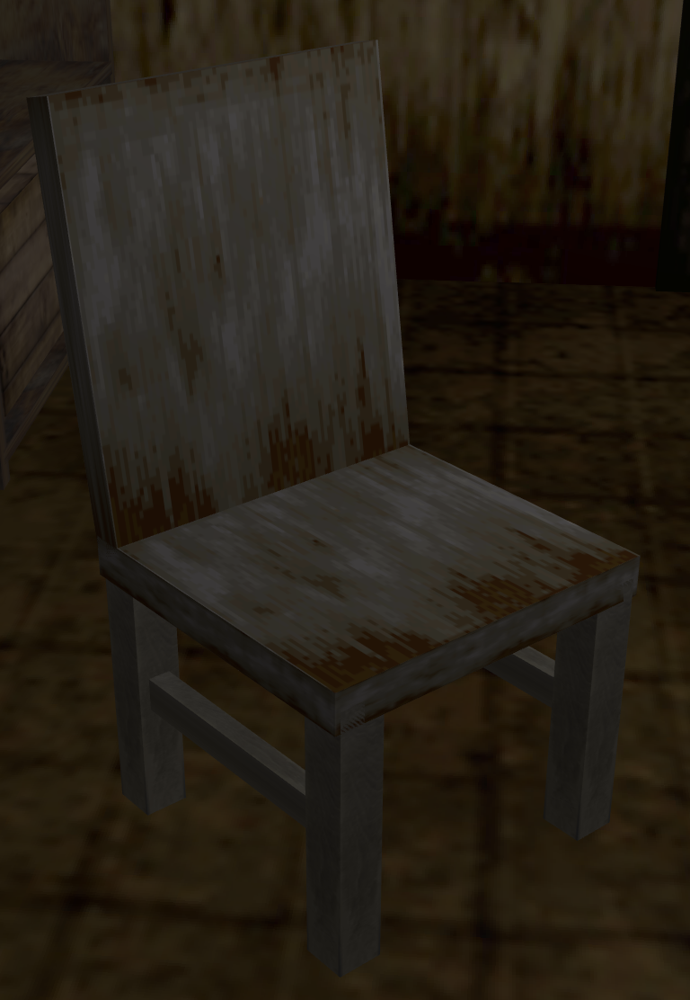

In the chair were applied simple textures, as we don't think it's one of the main objects of our scene.

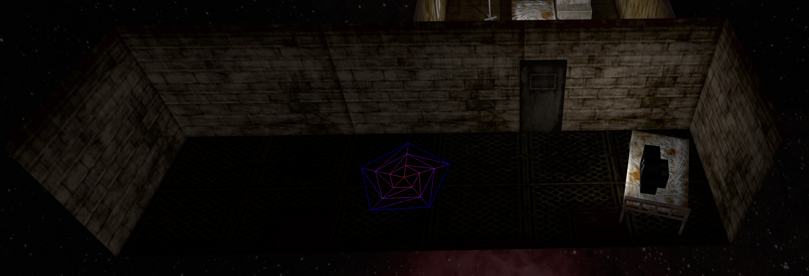

The corridor includes various objects, such as a second bed, a tv and the buffer polygon. This corridor connects to our main room via the door. 

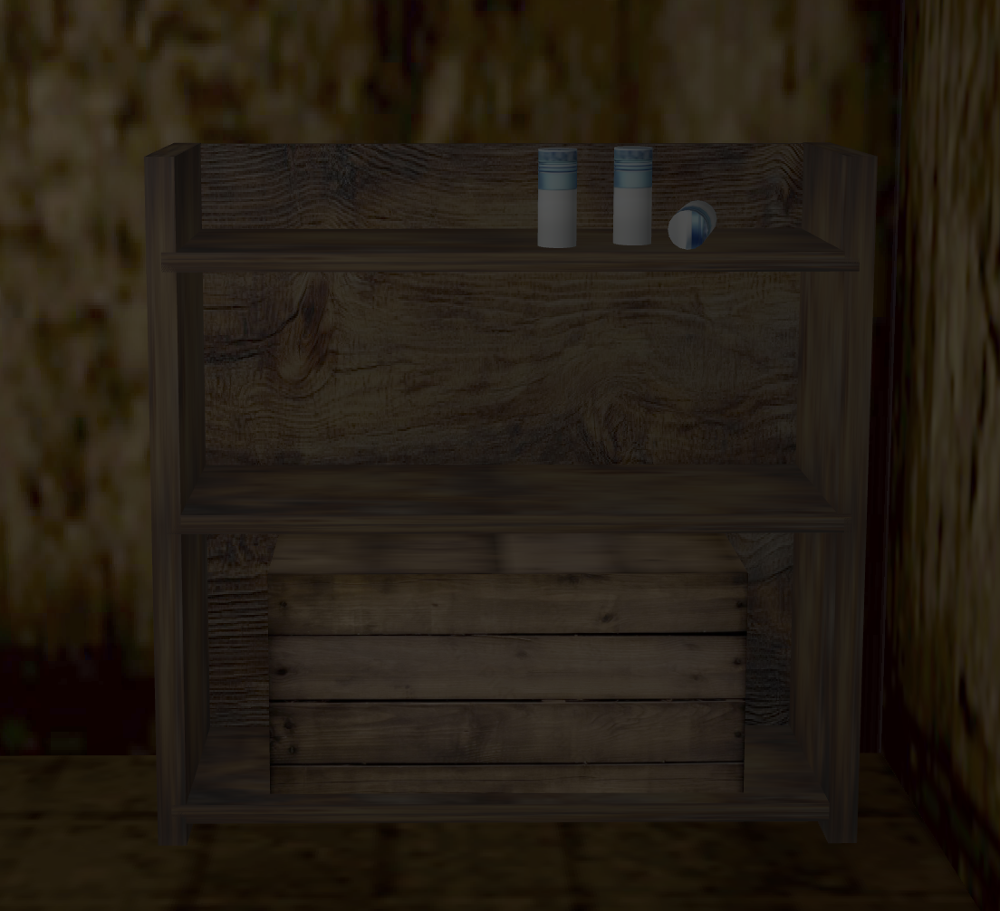

Just like on the original Silent Hill 1 scene, we decided to implement a cupboard, featuring a box in the last shelf, and 3 bottles in the top shelf. 

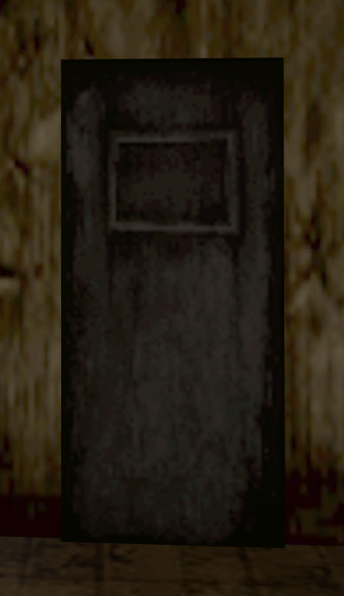

This door connects both the main room and the corridor. 

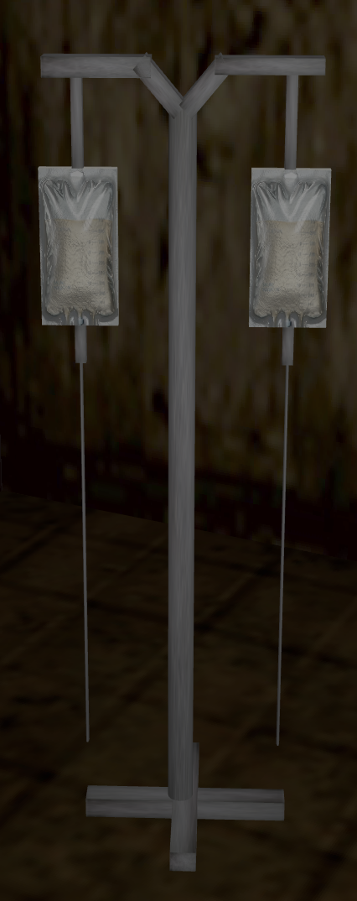

Just like any hospital, we decided to implement a IV stand. The wireframe was implemented for this object in particular. 

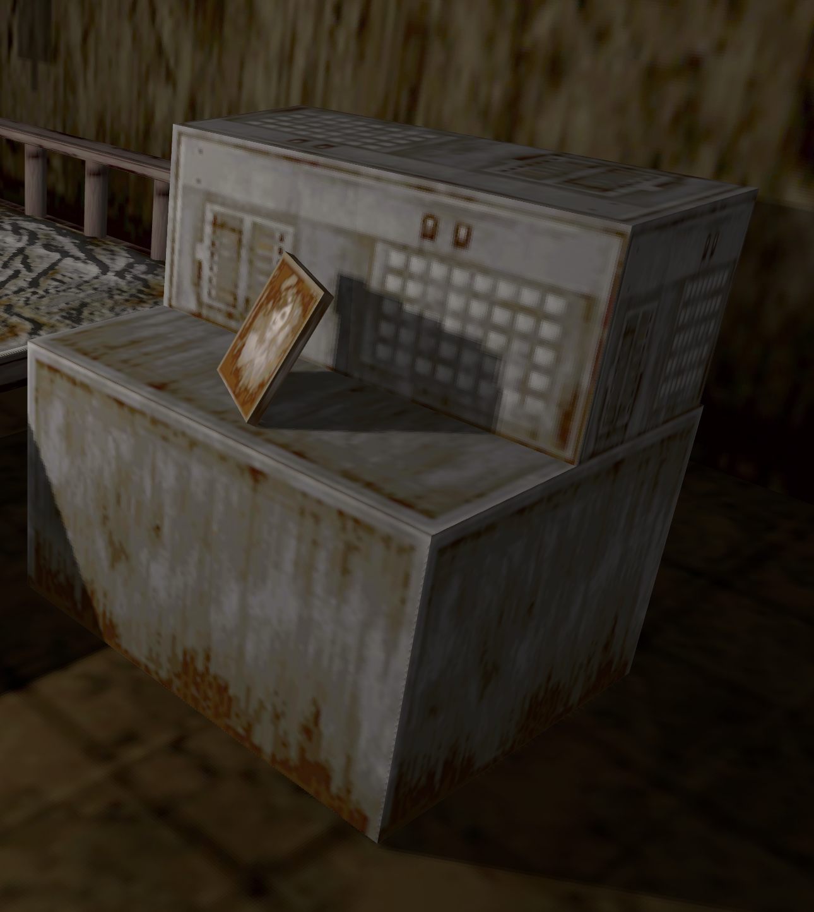

This main machine, includes buttons to operate it, and includes the portrait of a women, just like in the original game. 

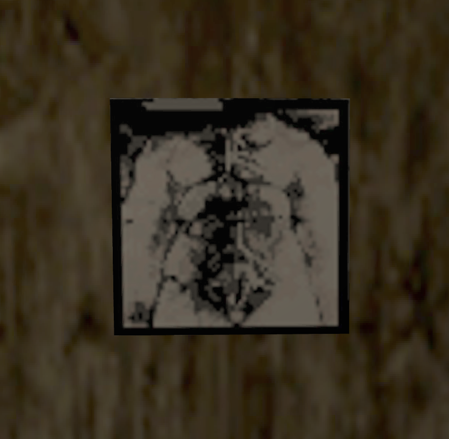

For the painting on the wall, as we didn't find the original texture, we decided to apply a new texture that clearly gets well integrated with our scene. 

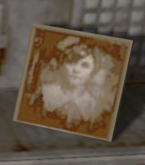

This is a portrait of a women, just like in the original game, placed in the machine next to the bed.

This is our main room, that includes all the objects that were described above.

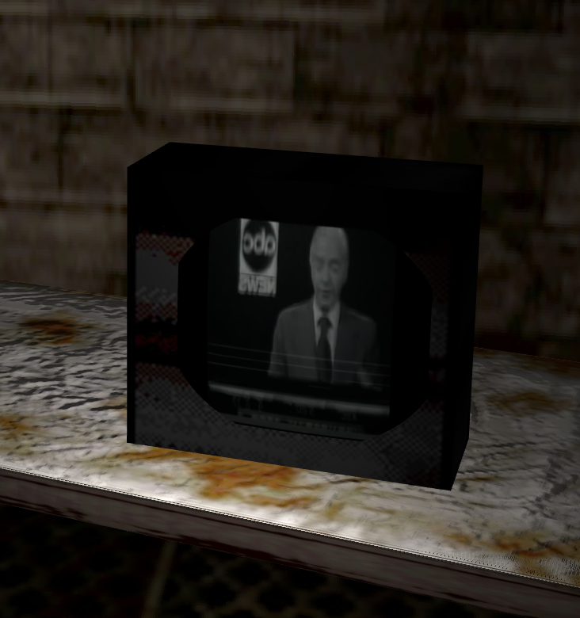

The TV is placed on the bed located in the corridor. This is were we implement the video texture. The video is running on the TV, on a quiet corridor, just like in a horror game. 

----
## Issues/Problems

- Initially, we had some issues with rendering textures. Thankfully we were able to fix those issues. 

We really enjoyed developing this scene, as we both like videogames, and recreating a scene from a very well know game was a big motivation for us. 