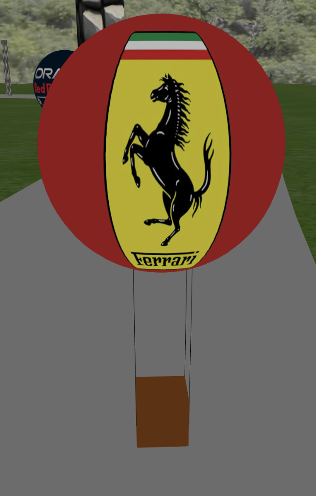
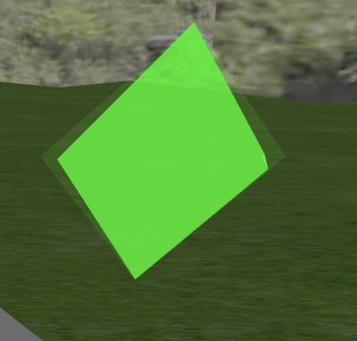
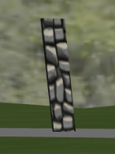
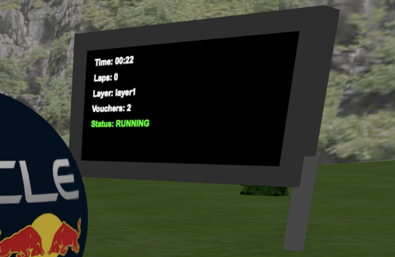
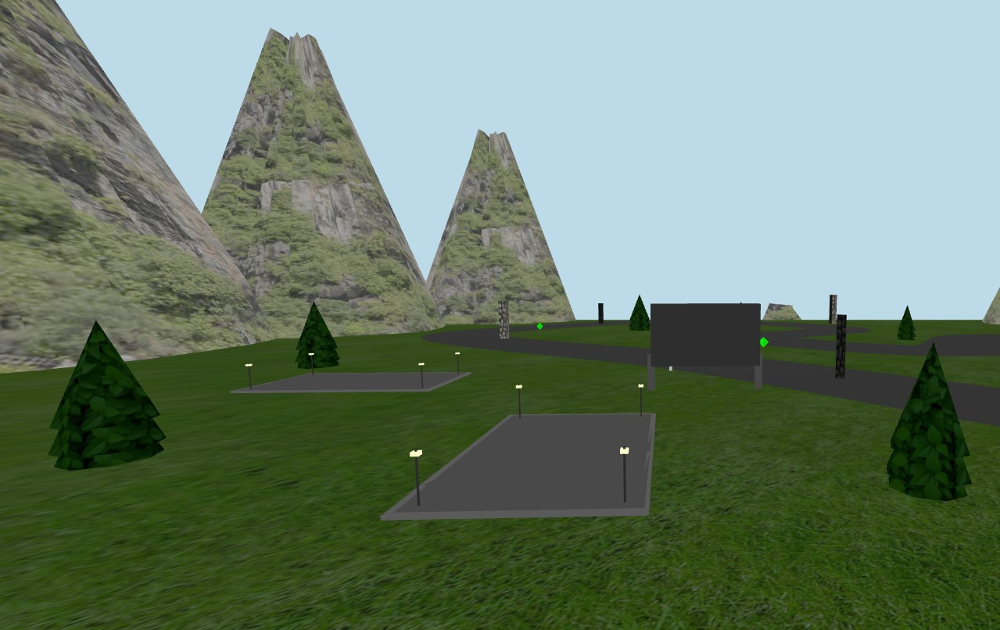
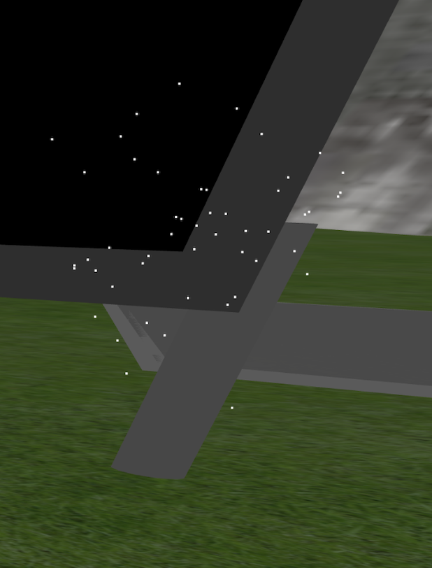
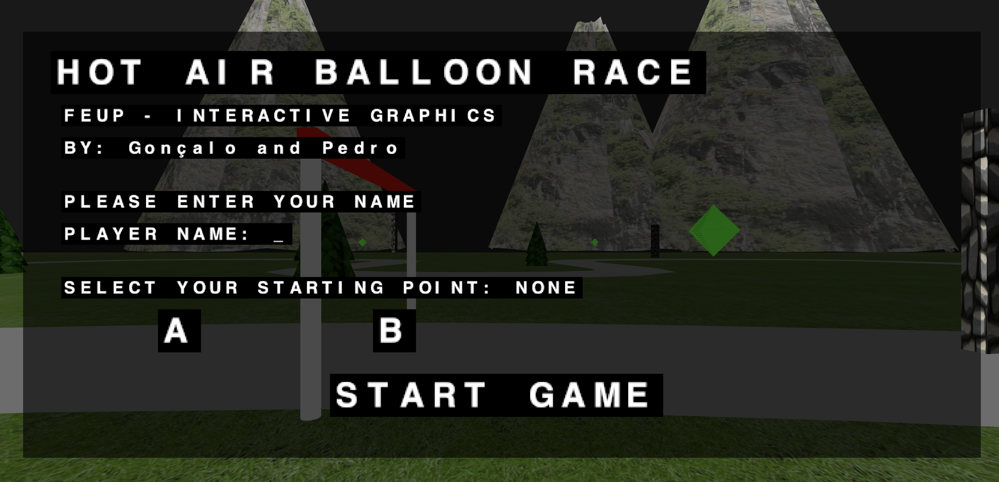
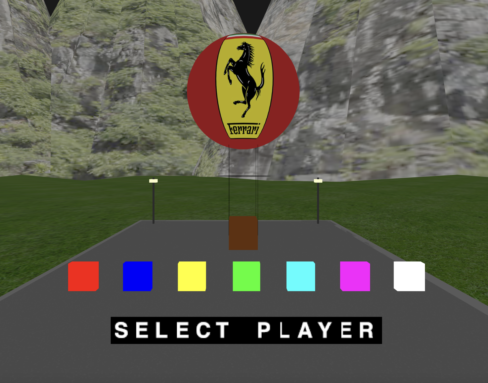

# SGI 2024/2025

## Group T08-G09
| Name             | Number    | E-Mail             |
| ---------------- | --------- | ------------------ |
| Pedro Moreira        | 201904642 | up201904642@up.pt                |
| Gonçalo Matias         | 202108703 | up202108703@up.pt                |

----

## Project information

The objective of this work is to develop a small 3D racing game. The game consists of a trip/race on a hot air balloon controlled by the user.

The most important topics to be covered are:

- Mechanics of the game
- Game elements
- Techniques to implement
- Interaction

Our README is divided by sections, so it is easier to understand everything we implemented for this project. 

Relative link: 
[Our Scene](tp3/MyContents.js)

Below are some images that show the work we produced for this project. 

 - [Balloon](#Balloon)
 - [Track](#Track)
 - [Power-ups](#Power-ups)
 - [Obstacles](#Obstacle)
 - [Outdoor Display](#outdoordisplay)
 - [Scenario](#Scenario)
 - [Particles system](#particles)
 - [Initial Menu](#menu1)
 - [Balloon Menu](#menu2)
 - [Ending Menu](#menu3)

----

#### Images and explanations

The Balloon was created using a sphere and a basket. Every Balloon has a texture applied to it, representing different teams. The Balloon can move in any direction, by using the W and S keys. 

We used the track shown by the teachers, as we thought it had a nice balance between competitive corners and fast straights.  

We implemented various Power-Ups across the track, for the player redeem and increase its voucher count.    

We also have various obstacles across the track, that the player should avoid in order not to lose vouchers and get penalties. 

The Outdoor Display includes some useful information, such as time, lap count, layer, number of vouchers of the player and status of the game. 

The scenario is composed with tress, mountains and grass along the track, creating a natural ambiance.  

The particles represent fireworks, and show up when the game ends. 

This is the inicial menu, where the player writes his name and selects his starting point.   

The second menu allows the player to choose across different racing teams, as well as choosing the opponent team.  

The end menu shows up when the race ends, for example when all laps are done. This menu shows the race results, including the winner, the time taken to complete all laps, and the color of the balloon of our player and opponent. 

----
## Issues/Problems

- Bad time organization
- Bad communication
- Bad division of work
- Balloon control is difficult and not very intuitive